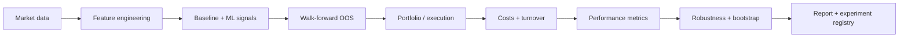

# AI Quant Trading System

[](https://github.com/tu-h-nguyn/AI-Quant-Trading-System/actions/workflows/ci.yml) [](https://github.com/tu-h-nguyn/AI-Quant-Trading-System/actions/workflows/research.yml)

A research-grade, end-to-end AI quantitative trading laboratory focused on one question: **does a leakage-aware machine-learning signal add value out of sample after trading frictions, relative to simple trading rules?**

> Research and educational software only. Not investment advice and not intended for live trading.

## Flagship study

The primary artifact is `scripts/run_flagship_study.py`. It runs the same experiment across **SPY, QQQ, IWM, TLT, and GLD** and evaluates:

| Family | Strategy |
|---|---|
| Baseline | Buy & Hold |
| Baseline | Momentum |
| Baseline | Moving-average crossover |
| ML | Logistic Regression |
| ML | XGBoost |

The ML models are evaluated with **chronological walk-forward refits**, a configurable **embargo/gap**, and **transaction-cost-aware backtesting**. Results are written to `reports/flagship_research_report.md`, `reports/flagship_results.csv`, and `reports/flagship_aggregate_results.csv` and registered as machine-readable experiment metadata.

### Research loop



## What makes the project quant-research oriented

The repository is deliberately organized around **research validity**, not only model training. The core pipeline separates data, features, models, portfolio construction, risk, execution assumptions, validation, diagnostics, and reporting so that an experiment can be changed without silently changing its backtest logic.

Key safeguards include:

- chronological train/test ordering; no random shuffling for time series;
- walk-forward refitting from independent estimator clones;
- configurable gap/embargo for labels with forward horizons;
- features computed from current/past information only;
- portfolio weights estimated from trailing observations and lagged before return application;
- transaction costs charged on turnover;
- explicit comparison against non-ML baselines;
- moving-block bootstrap diagnostics for dependent daily returns;
- machine-readable experiment records containing configuration and source commit.

## Research capabilities

- Multi-asset OHLCV download and aligned return panels.
- Lagged return, volatility, moving-average, and volume features.
- Logistic Regression and XGBoost classifiers.
- Walk-forward out-of-sample probability generation.
- Time-series split infrastructure with gap support.
- Buy-and-hold, momentum, and moving-average baselines.
- Long-only constrained minimum-variance and risk-parity allocation.
- Rolling portfolio construction using trailing observations only.
- Volatility targeting and drawdown guardrails.
- Transaction-cost and turnover modeling.
- Benchmark-relative diagnostics, rolling Sharpe, subperiod analysis, and bootstrap intervals.
- Probability calibration, threshold diagnostics, and feature importance.
- Automated research figures and Markdown reports.
- Unit tests, linting, and GitHub Actions reproducibility checks.

## Quickstart

```bash
python -m venv .venv
source .venv/bin/activate  # Windows: .venv\\Scripts\\activate
pip install -e ".[dev]"
python scripts/download_data.py
python scripts/run_flagship_study.py
python scripts/run_v5_report.py
python scripts/run_research.py
python scripts/run_polymarket_study.py
python scripts/scan_polymarket_arbitrage.py --source simulation
pytest
ruff check src scripts
```

The equities universe is configured in `configs/default.yaml` and the
prediction-market track in `configs/polymarket.yaml`. The configuration also controls the label horizon, walk-forward geometry, embargo, transaction costs, portfolio constraints, and bootstrap settings.

## Flagship outputs

After a successful run:

- `reports/flagship_research_report.md` — the human-readable research narrative and results tables;
- `reports/flagship_results.csv` — per-asset, per-strategy OOS results;
- `reports/flagship_aggregate_results.csv` — equal-weight aggregate OOS results;
- `reports/experiments/flagship_oos_study.json` — reproducibility metadata and source commit;
- `reports/v5_research_report.md` — deeper single-asset diagnostics;
- `reports/figures/` — equity, drawdown, turnover, calibration, rolling-Sharpe, and feature-importance plots.

The flagship report is intentionally designed so the central claim can be **supported, weakened, or rejected by the observed evidence**. A model that fails to beat a simple baseline is a valid research result; the repository does not assume profitability in advance.

## How to read the results

Start with `flagship_aggregate_results.csv`, then inspect the per-asset table. The relevant comparison is not a single headline return: check predictive AUC, CAGR, Sharpe, Sortino, drawdown, turnover, and the behavior across assets. A useful result should remain interpretable after costs and should not depend on one unusually favorable asset or period.

The bootstrap interval in the report is a dependence-aware diagnostic for mean daily returns. It should be read alongside subperiod and per-asset behavior, not as a guarantee of future performance.

## Methodology notes

The ML target is the sign of the configured forward return horizon. The trading signal threshold is fixed from configuration and is not optimized on the final OOS sample. Model AUC is reported as a predictive diagnostic, while trading metrics are calculated from a separate cost-aware backtest.

The aggregate strategy series is the equal-weight average of the per-asset OOS return series. This is intentionally transparent rather than being treated as an optimized portfolio-selection result.

Backtests remain historical simulations. Market-data revisions, execution slippage, liquidity constraints, borrow costs, corporate actions, regime shifts, and model risk can materially change live outcomes.

## Polymarket prediction-market layer

The second research track targets **Polymarket**, where a contract's price *is* a
probability and settles at exactly 0 or 1. That changes what "edge" means, so the
layer is built around two separate profit sources rather than one.

### 1. Structural arbitrage — edge that does not depend on a forecast

A binary market's two outcomes must settle to one dollar between them, and a
venue-guaranteed exhaustive outcome set must settle to one dollar across all its
members. When a basket can be assembled for less than its guaranteed settlement
value, the profit is an accounting identity:

| Scanner | Identity exploited |
|---|---|
| `binary_complement` | YES + NO asks clear $1 → buy both, settle at $1 |
| `binary_mint_and_sell` | YES + NO bids clear $1 → split collateral, sell both |
| `group_dutch_book` | YES basket over `n` exclusive outcomes costs under $1 |
| `neg_risk_no_basket` | NO basket over `n` exclusive outcomes costs under `n - 1` |

Every basket is sized by **walking each leg's book jointly**, charged the
configured taker fee, and capped by a capital budget, so the reported size is
what the snapshot could actually absorb rather than top-of-book. Only
Polymarket `negRisk` groups are treated as verified partitions; any other
grouping is refused by default, because an incomplete outcome list makes the
"guaranteed" payout false.

```bash
python scripts/scan_polymarket_arbitrage.py --source simulation   # self-test
python scripts/fetch_polymarket_data.py                            # snapshot the venue
python scripts/scan_polymarket_arbitrage.py --source snapshot      # scan it
```

The self-test runs against synthetic books containing a known set of planted
mispricings, so it checks the scanner for false negatives *and* false positives.

### 2. Forecast edge — beating the market's own probability

The second source requires a probability forecast better than the price. Three
design decisions carry most of the weight here, and each came out of a measured
failure rather than a preference:

**Anchor the model to the price.** Treating the market price as an ordinary
feature asks the model to re-estimate the coefficient on the single strongest
predictor available, from the few hundred *independent* settled markets a real
panel supplies. A coefficient of 0.8 where the truth is 1.0 shrinks every
forecast toward a coin flip and scores worse than simply quoting the price —
which is exactly what the unanchored entrant does in the study.
`MarketAnchoredClassifier` instead fits

```text
logit(q) = logit(market price) + g(other features)
```

so `g = 0` reproduces the market exactly and regularization makes deferring to
the price the default. The worst case degrades to the market's forecast rather
than to something worse.

**Split by settlement, not by row.** Every snapshot of one market shares a
single label, so a row-wise walk-forward puts the same outcome on both sides of
the boundary. On the study panel that leaked 160 markets across one split.
`resolution_aware_walk_forward` trains only on markets that had **already
settled** when each test block began — the live constraint — which makes group
leakage impossible by construction and never uses a label before it was knowable.

**Read skill against the achievable ceiling.** Brier score on binary outcomes is
dominated by the irreducible variance `q(1 - q)`, so an oracle holding the true
probabilities scores only about `+0.010` against a roughly efficient price. A
model at `+0.004` has captured nearly half of everything available, not "almost
nothing". The study reports the ceiling alongside every skill score, and scores
every entrant on one common out-of-sample window so the comparison is between
strategies rather than between calendar periods.

### 3. Market making — being paid the spread instead of paying it

Everything above is taker-side: it crosses the spread and pays for immediacy. A
maker is paid for it, and on a venue quoting a few cents against a one-dollar
payoff that is frequently larger than any forecast edge available.

It fails for a different reason than forecasting does. A resting quote is filled
precisely when someone wants the other side, which is disproportionately when
they know something — so a maker buys just before the price falls and sells just
before it rises. `simulate_market_making` splits flow into two regimes to make
that cost explicit rather than assuming it away:

- **Informed flow** — a price move through a quote fills it, and the position is
  marked at the new price immediately. The loss is automatic.
- **Uninformed flow** — a configurable share of periods fill without any price
  move. **All maker profit comes from this group**, and its size is a property of
  the venue that price history cannot measure.

So `uninformed_fill_rate` is swept, not assumed, and the report states the
break-even condition instead of a point estimate. On the synthetic panel:

| Quoting around | Break-even uninformed fill rate |
|---|---|
| Market price | ~29% |
| Market-anchored model forecast | profitable at every rate, including 0% |

That second row is the interesting one: quoting around a forecast roughly halves
the adverse selection a maker pays, because the quote leans away from the moves
that would otherwise run it over. A forecast edge is worth more to a maker than
to a taker — the taker gets it only when the edge clears the spread, the maker
collects the spread *and* the edge on every fill.

Inventory is capped and quotes are skewed against it, quotes widen inside a
configurable window before resolution where flow is most informed, concurrency
is capped because a maker quotes a chosen subset rather than the whole venue,
and a short YES position is collateralized at a dollar a share because that is
what settlement can demand. A fill the cash balance cannot fund is declined and
counted, and the report flags a run where that happened rather than letting an
under-capitalized book quietly understate both its losses and its gains.

### Resolution risk

A prediction market pays out on what the resolver decides, not on what happened.
Questions get settled on technicalities, disputed, or voided — and at a thin edge
that is a first-order cost, not a footnote. It is charged twice: the forecast is
discounted before sizing, and the simulation realizes failures at the same rate.

The useful output is analytic, so it carries no sampling noise — for a position
entered at each price with a 4% edge, the settlement failure rate at which
expected value reaches zero:

| Entry price | Max tolerable resolution risk |
|---:|---:|
| 0.10 | 28.6% |
| 0.50 | 7.4% |
| 0.90 | 4.3% |

**Expensive contracts are the fragile ones.** At ninety cents there is almost
nothing above the entry price left to win, so a small failure rate erases the
whole trade. A book concentrated in high-priced favourites is betting on the
resolver as much as on the outcome.

One modelling trap is worth naming, because the first version of this had it:
recovery on a failed resolution must be **zero**. Under a 50% recovery — which
looks realistic, since voided markets often pay both sides half — a five-cent
longshot *gains* from the venue failing, and a strategy optimized against that
model learns to buy lottery tickets on bad resolution. A risk model that pays
you is not a risk model.

### Sizing, frictions, and execution

- Kelly sizing for a one-dollar payoff, `f* = (q - c) / (1 - c)` on the **all-in**
  cost, under fractional-Kelly, per-market, and aggregate exposure caps.
- Forecasts shrunk toward the market price before sizing, because a stale quote
  that looks mispriced is usually adverse selection rather than edge.
- Orders sized against a **limit price that already embeds the required edge**,
  so a fill can never happen at a price that destroys the reason for the trade.
- One order per event, since markets under one event are a single bet wearing
  several names.
- Event-driven backtesting: capital is locked until settlement and cannot be
  spent twice, entries pay the ask, and positions pay exactly $1 per winning
  share.

### Capital velocity

A prediction-market position ties up capital until it settles, which can be
months. Once its price has converged to the forecast it earns nothing while
continuing to block every other opportunity — but exiting gives up the tail of
the edge and pays the spread a second time.

ROI per trade cannot settle that trade-off: it scores a six-month hold and a
one-week turn identically. The backtester therefore reports **profit per
capital-year** — dollars earned per dollar-year of capital actually committed —
and the study runs the same forecast under each exit rule. On the synthetic
panel:

| Exit rule | Mean hold | ROI per trade | Profit per capital-year |
|---|---:|---:|---:|
| Hold to settlement | 30.6 days | +0.33 | +3.89 |
| Exit at 25% of edge remaining | 7.4 days | +0.15 | +7.49 |
| Exit at 50% of edge remaining | 6.5 days | +0.14 | +8.16 |

Per-trade ROI halves and return per capital-year doubles. A rule that raises
both would be suspicious — early exit can only recycle edge, never create it.
Exit rules are off by default so hold-to-settlement stays the baseline.

```bash
python scripts/run_polymarket_study.py      # flagship study → reports/polymarket_research_report.md
```

## Running it

The research scripts answer whether an edge exists. `scripts/run_polymarket_trader.py`
is what you would actually run — safe to invoke repeatedly, on a schedule or by
hand, because the paper account persists between runs.

```bash
# self-contained, no network: settled history and open markets from one world
python scripts/run_polymarket_trader.py --source simulation

# replay the last stored snapshot, judged at the clock it was captured with
python scripts/run_polymarket_trader.py --source snapshot

# public data from the venue; orders still go only to the local ledger
python scripts/run_polymarket_trader.py --source live --plan-only
```

Each run settles matured positions, acquires markets and books, fits the
market-anchored model **on markets that have already settled**, scores the open
ones, scans for structural arbitrage, builds a risk-gated plan, and records it in
the paper account.

Two things it gets right that a naive loop does not:

- **The clock travels with the data.** A replayed snapshot is evaluated at the
  moment it was captured, not at wall time — otherwise the resolution-window
  gates reject markets that were tradable when the data was taken.
- **The exposure cap belongs to the account, not the run.** Re-planning against
  whatever cash is left adds another 20% every invocation and pushes a 20% limit
  past 50% in three passes. The plan is told what is already committed.

Feature parity between training and scoring is enforced by building both frames
through the same call: a model fitted with momentum columns cannot score a bare
snapshot, and filling those columns with zeros would score every market as if
its price had never moved. A mismatch raises naming every missing column rather
than a `KeyError` on the first one.

The live path is unreachable from CI, so it is driven through a fake venue in
`tests/test_polymarket_live_path.py` — market pagination, book fetching, price
history, the settled-panel build, retry and rate-limit behaviour, and a full
acquire → forecast → plan → paper-fill round trip. The first real run should not
be the first time that code has executed.

### What this layer does *not* do

It never signs, funds, or submits an order. `build_order_plan` produces an
audited, risk-gated plan and `PaperBroker` executes it against a cash ledger;
live submission needs custody of a funded wallet and cannot be exercised by this
repository's tests, so it is left as a deliberate, separate integration behind
the `ExecutionAdapter` protocol.

### Honest status of the evidence

Polymarket's API is not reachable from every environment. When no cached panel
is present the study runs on **synthetic markets where an edge exists by
construction**, and says so at the top of its report. That run validates that
sizing, frictions, settlement, leakage control, and capital accounting are wired
together correctly — it is not evidence of edge on the real venue. Run
`scripts/fetch_polymarket_data.py` to replace the panel with real settled
markets; until then, the arbitrage scanners are the only component whose edge is
provable rather than estimated. The market-making results are a second layer of
assumption on top of that: they depend on a flow composition the simulation
cannot observe, which is why the break-even rate is reported rather than a P&L.

One finding from the synthetic runs is worth stating because it sets a
precondition for the whole track: **below roughly 2,500 settled markets the
study cannot detect the edge it plants.** A panel of 800 markets returns a
negative skill score even though the edge is there, because a few hundred
independent binary outcomes cannot pin down a correction worth a few thousandths
of a Brier point. Panel size is a precondition for this research, not a knob.

## Repository structure

```text
configs/                       experiment configuration
data/                          local datasets (ignored)
scripts/
  download_data.py             reproducible data acquisition
  run_flagship_study.py        main multi-asset research experiment
  run_v5_report.py             deeper diagnostics for first asset
  run_research.py              rolling portfolio research
  fetch_polymarket_data.py     Polymarket snapshots + resolved training panel
  scan_polymarket_arbitrage.py structural mispricing scanner
  run_polymarket_study.py      Polymarket OOS research experiment
  run_polymarket_trader.py     operational loop: plan and paper-execute
src/quant_system/
  data/                        acquisition/loading/panel construction
  features/                    feature engineering
  models/                      ML estimators and signal transforms
  portfolio/                   portfolio optimization and rolling weights
  risk/                        volatility and drawdown controls
  backtest/                    simulation, costs, metrics
  evaluation/                  OOS, diagnostics, robustness, reports
  polymarket/                  prediction-market research and trading layer
    pricing.py                 binary-contract arithmetic, fees, break-even
    orderbook.py               depth-aware execution against a CLOB book
    markets.py                 normalized market/outcome records
    client.py                  read-only Gamma + CLOB client, snapshots
    arbitrage.py               structural, model-free mispricing scanners
    kelly.py                   bankroll sizing under edge uncertainty
    features.py                leakage-safe snapshot feature engineering
    model.py                   market-anchored and calibrated estimators
    validation.py              resolution-aware out-of-sample splitting
    backtest.py                event-driven simulation with 0/1 settlement
    market_making.py           two-sided quoting, inventory, adverse selection
    metrics.py                 skill-vs-price and bankroll diagnostics
    execution.py               risk-gated order planning and paper broker
    simulation.py              deterministic synthetic markets
  config.py                    shared experiment configuration loader
tests/                         research invariants and regressions
reports/experiments/           generated experiment metadata
reports/figures/               generated research figures
.github/workflows/              reproducible CI + artifact publication
```

## Roadmap

### V6 — Research-to-Engineering

- ~~Hyperparameter selection nested inside time-series validation~~ (done for the
  market-anchored model: the penalty is chosen by chronological hold-out inside
  each training window).
- Live Polymarket panel: replace the synthetic study data with cached settled
  markets, then re-run the skill test against the real venue.
- Cross-venue comparison of the same question against other prediction markets.
- Cross-sectional factor pipeline and portfolio-level ML ranking.
- More realistic execution model: spread, commissions, slippage, and market impact.
- Statistical tests for forecast and return significance.
- Experiment comparison dashboard.
- FastAPI inference service and Dockerized execution environment.

### V7 — Production research stack

- Dataset versioning and data-quality checks.
- Scheduled retraining and monitoring.
- Model registry and run lineage.
- Paper-trading interface with audit logs.

## Disclaimer

This repository is for research and education. Backtests are historical simulations and can contain model error, estimation error, data issues, and assumptions that differ from real execution. Nothing in this repository constitutes investment advice.
