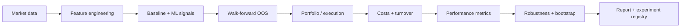

# AI Quant Trading System

A research-grade, end-to-end AI quantitative trading laboratory focused on one question: **does a leakage-aware machine-learning signal add value out of sample after trading frictions, relative to simple trading rules?**

> Research and educational software only. Not investment advice and not intended for live trading.

## Flagship study

The primary artifact is `scripts/run_flagship_study.py`. It runs the same experiment across **SPY, QQQ, IWM, TLT, and GLD** and evaluates:

| Family | Strategy |
|---|---|
| Baseline | Buy & Hold |
| Baseline | Momentum |
| Baseline | Moving-average crossover |
| ML | Logistic Regression |
| ML | XGBoost |

The ML models are evaluated with **chronological walk-forward refits**, a configurable **embargo/gap**, and **transaction-cost-aware backtesting**. Results are written to `reports/flagship_research_report.md`, `reports/flagship_results.csv`, and `reports/flagship_aggregate_results.csv` and registered as machine-readable experiment metadata.

### Research loop



## What makes the project quant-research oriented

The repository is deliberately organized around **research validity**, not only model training. The core pipeline separates data, features, models, portfolio construction, risk, execution assumptions, validation, diagnostics, and reporting so that an experiment can be changed without silently changing its backtest logic.

Key safeguards include:

- chronological train/test ordering; no random shuffling for time series;
- walk-forward refitting from independent estimator clones;
- configurable gap/embargo for labels with forward horizons;
- features computed from current/past information only;
- portfolio weights estimated from trailing windows and lagged before return application;
- transaction costs charged on turnover;
- explicit comparison against non-ML baselines;
- moving-block bootstrap diagnostics for dependent daily returns;
- machine-readable experiment records containing configuration and source commit.

## Research capabilities

- Multi-asset OHLCV download and aligned return panels.
- Lagged return, volatility, moving-average, and volume features.
- Logistic Regression and XGBoost classifiers.
- Walk-forward out-of-sample probability generation.
- Time-series split infrastructure with gap support.
- Buy-and-hold, momentum, and moving-average baselines.
- Long-only constrained minimum-variance and risk-parity allocation.
- Rolling portfolio construction using trailing observations only.
- Volatility targeting and drawdown guardrails.
- Transaction-cost and turnover modeling.
- Benchmark-relative diagnostics, rolling Sharpe, subperiod analysis, and bootstrap intervals.
- Probability calibration, threshold diagnostics, and feature importance.
- Automated research figures and Markdown reports.
- Unit tests, linting, and GitHub Actions reproducibility checks.

## Quickstart

```bash
python -m venv .venv
source .venv/bin/activate  # Windows: .venv\\Scripts\\activate
pip install -e ".[dev]"
python scripts/download_data.py
python scripts/run_flagship_study.py
python scripts/run_v5_report.py
python scripts/run_research.py
pytest
ruff check src scripts
```

The default universe is configured in `configs/default.yaml`. The configuration also controls the label horizon, walk-forward geometry, embargo, transaction costs, portfolio constraints, and bootstrap settings.

## Flagship outputs

After a successful run:

- `reports/flagship_research_report.md` — the human-readable research narrative and results tables;
- `reports/flagship_results.csv` — per-asset, per-strategy OOS results;
- `reports/flagship_aggregate_results.csv` — equal-weight aggregate OOS results;
- `reports/experiments/flagship_oos_study.json` — reproducibility metadata and source commit;
- `reports/v5_research_report.md` — deeper single-asset diagnostics;
- `reports/figures/` — equity, drawdown, turnover, calibration, rolling-Sharpe, and feature-importance plots.

The flagship report is intentionally designed so the central claim can be **supported, weakened, or rejected by the observed evidence**. A model that fails to beat a simple baseline is a valid research result; the repository does not assume profitability in advance.

## Methodology notes

The ML target is the sign of the configured forward return horizon. The trading signal threshold is fixed from configuration and is not optimized on the final OOS sample. Model AUC is reported as a predictive diagnostic, while trading metrics are calculated from a separate cost-aware backtest.

The aggregate strategy series is the equal-weight average of the per-asset OOS return series. This is intentionally transparent rather than being treated as an optimized portfolio-selection result.

Backtests remain historical simulations. Market-data revisions, execution slippage, liquidity constraints, borrow costs, corporate actions, regime shifts, and model risk can materially change live outcomes.

## Repository structure

```text
configs/                       experiment configuration
data/                          local datasets (ignored)
scripts/
  download_data.py             reproducible data acquisition
  run_flagship_study.py        main multi-asset research experiment
  run_v5_report.py             deeper diagnostics for first asset
  run_research.py              rolling portfolio research
src/quant_system/
  data/                        acquisition/loading/panel construction
  features/                    feature engineering
  models/                      ML estimators and signal transforms
  portfolio/                   portfolio optimization and rolling weights
  risk/                        volatility and drawdown controls
  backtest/                    simulation, costs, metrics
  evaluation/                  OOS, diagnostics, robustness, reports
  config.py                    shared experiment configuration loader
tests/                         research invariants and regressions
reports/experiments/           generated experiment metadata
reports/figures/               generated research figures
.github/workflows/              reproducible CI + artifact publication
```

## Roadmap

### V6 — Research-to-Engineering

- Hyperparameter selection nested inside time-series validation.
- Cross-sectional factor pipeline and portfolio-level ML ranking.
- More realistic execution model: spread, commissions, slippage, and market impact.
- Statistical tests for forecast and return significance.
- Experiment comparison dashboard.
- FastAPI inference service and Dockerized execution environment.

### V7 — Production research stack

- Dataset versioning and data-quality checks.
- Scheduled retraining and monitoring.
- Model registry and run lineage.
- Paper-trading interface with audit logs.

## Disclaimer

This repository is for research and education. Backtests are historical simulations and can contain model error, estimation error, data issues, and assumptions that differ from real execution. Nothing in this repository constitutes investment advice.
